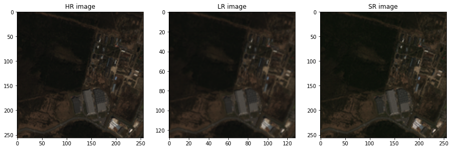

# Satellite Imagery Super-Resolution

## Datasets

`datasets.py` take only the directory that contains high resolution image and  downgrade the image automatically to generate the pair dataset.

It also support passing the custom downgrading method through `downgrading_method`

Down-scaling factor is set to 4. `(h, w) => (h/4, w/4)`

## Models

Adopts `SwinIR`. 

- Input size is (128, 128)
- Output size is (256, 256)

## Config

| Config          |                   |
|-----------------|-------------------|
| DEVICE          | device            |
| HR_SIZE         | 256               |
| LR_SIZE         | 128               |
| WorldStrat_path | path_to_directory |
| transform_hr    | ~                 |
| transform_hr    | ~                 |

## Output result

